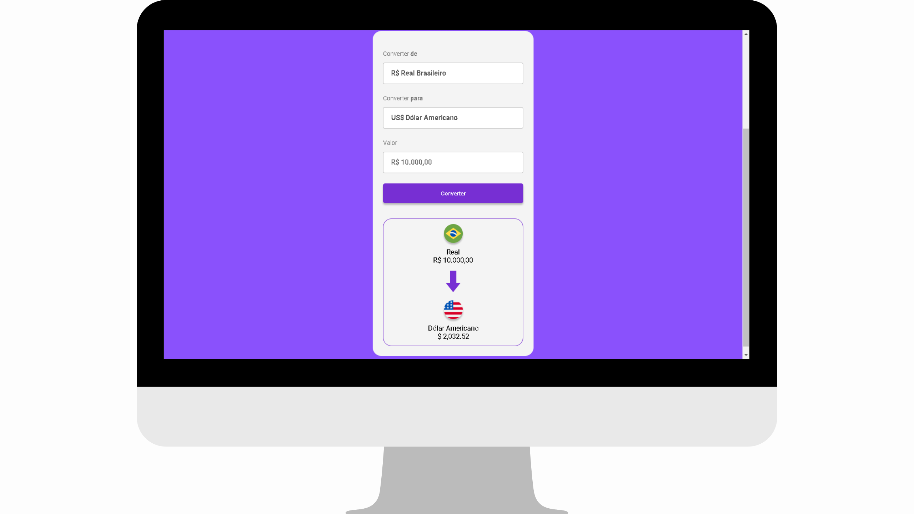

<h1 align="center">
  Interactive Converter
</h1>

[We are ONLINE, try Now](https://interactive-converter.netlify.app/) :tada: 

<h3 align="left">
  Esse foi um projeto que eu aprendi no <a href="https://rodolfomori.com.br/devclub/">DevClub</a>
</h3>

 

  <a href="#house-about-the-project">About the project</a>&nbsp;&nbsp;&nbsp;|&nbsp;&nbsp;&nbsp;
  <a href="#computer-technologies">Technologies</a>&nbsp;&nbsp;&nbsp;

 

 

## :house: About the project

Um conversor interativo é uma ferramenta online simples que permite aos usuários converter valores entre diferentes moedas de forma dinâmica. |Os usuários podem inserir o valor desejado, escolher as moedas de origem e destino, e a ferramenta exibe instantaneamente o valor convertido. Essa página fácil de usar é útil para viajantes e profissionais que precisam acompanhar as taxas de câmbio, proporcionando uma maneira rápida e conveniente de realizar conversões de moeda. 

 

## :computer: Technologies

- 
- 
- 

Made with ♥ by Daniel Balieiro :wave: [Get in touch!](https://www.linkedin.com/in/daniel-balieiro/)
t
